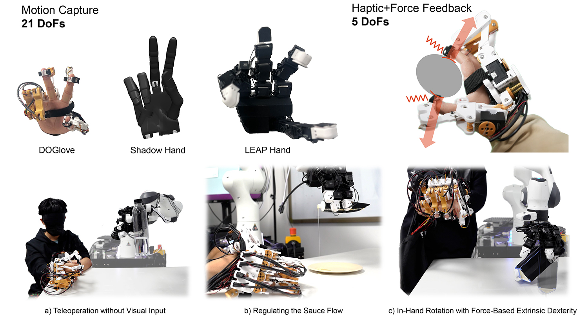

# <a href="https://do-glove.github.io/">DOGlove: Dexterous Manipulation with a Low-Cost Open-Source Haptic Force Feedback Glove</a>

**Robotics: Science and Systems (RSS) 2025**

<a href="https://do-glove.github.io/"><strong>Project Page</strong></a> | 
<a href="https://arxiv.org/pdf/2502.07730"><strong>Paper</strong></a> | 
<a href="https://tea-lab.github.io/DOGlove/"><strong>Documentation</strong></a> | 
<a href="https://www.bilibili.com/video/BV19SLizUEfa/"><strong>30min工作讲解</strong></a>


[Han Zhang](https://doublehan07.github.io/)<sup>1,2</sup>,
[Songbo Hu](https://hsb0508.github.io/)<sup>1</sup>,
[Zhecheng Yuan](https://gemcollector.github.io/)<sup>1,2,3</sup>
[Huazhe Xu](http://hxu.rocks/)<sup>1,2,3</sup>

<sup>1</sup>Tsinghua University,
<sup>2</sup>Shanghai Qi Zhi Institute,
<sup>3</sup>Shanghai AI Lab

<div align="center">
  
</div>

## 🐣 Updates
* **2025/04/28** — Initial commit.
* **2025/05/11** — Added embedded firmware repository.
* **2025/06/01** — Added MakerWorld link, PCBA files, and Onshape model link.


🚀 Content coming soon. Thanks for your patience!

## 🏷️ License
This repository is released under the MIT license. See [LICENSE](LICENSE) for more details.

## 👍 Acknowledgement
- Our wrist tracking code is adapted from [HTC Vive Tracker Python API](https://github.com/tianshengs/SteamVR_Tracking).
- Our Franka control code is adapted from [UMI](https://github.com/real-stanford/universal_manipulation_interface) and [Data Scaling Laws](https://github.com/Fanqi-Lin/Data-Scaling-Laws).
- Our 3D diffusion policy implementation is adapted from [3D Diffusion Policy](https://github.com/YanjieZe/3D-Diffusion-Policy) and [DemoGen](https://github.com/TEA-Lab/DemoGen).
- The teleoperation baseline (AnyTeleop) is implemented from [Dex Retargeting](https://github.com/dexsuite/dex-retargeting).

Contact [Han Zhang](https://doublehan07.github.io/) if you have any questions or suggestions.

## 📝 Citation
If you find our work useful, please consider citing:
```console
@article{zhang2025doglove,
  title={DOGlove: Dexterous Manipulation with a Low-Cost Open-Source Haptic Force Feedback Glove},
  author={Zhang, Han and Hu, Songbo and Yuan, Zhecheng and Xu, Huazhe},
  journal={arXiv preprint arXiv:2502.07730},
  year={2025}
}
```