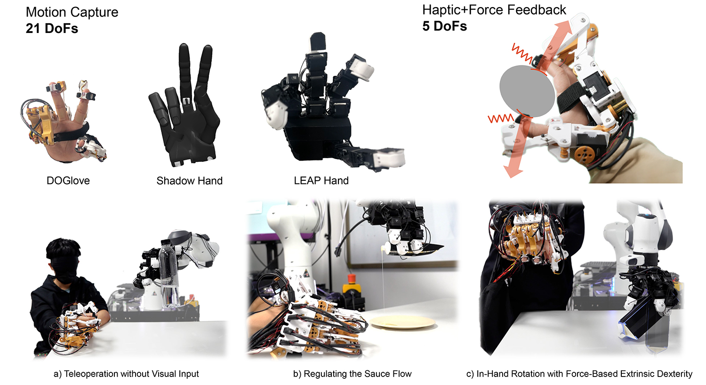

# <a href="https://do-glove.github.io/">DOGlove: Dexterous Manipulation with a Low-Cost Open-Source Haptic Force Feedback Glove</a>

**Robotics: Science and Systems (RSS) 2025**

<a href="https://do-glove.github.io/"><strong>Project Page</strong></a> | 
<a href="https://arxiv.org/pdf/2502.07730"><strong>Paper</strong></a> | 
<a href="https://tea-lab.github.io/DOGlove/"><strong>Documentation</strong></a> | 
<a href="https://www.bilibili.com/video/BV19SLizUEfa/"><strong>30min工作讲解</strong></a>


[Han Zhang](https://doublehan07.github.io/)<sup>1,2</sup>,
[Songbo Hu](https://hsb0508.github.io/)<sup>1</sup>,
[Zhecheng Yuan](https://gemcollector.github.io/)<sup>1,2,3</sup>
[Huazhe Xu](http://hxu.rocks/)<sup>1,2,3</sup>

<sup>1</sup>Tsinghua University,
<sup>2</sup>Shanghai Qi Zhi Institute,
<sup>3</sup>Shanghai AI Lab

<div align="center">
  
</div>

## 🐣 Updates
* **2025/04/28** — Initial commit.
* **2025/05/11** — Added embedded firmware repository.
* **2025/06/01** — Added MakerWorld link, PCBA files, and Onshape model link.
* **2025/06/22** — Update the tutorial. Add the Python scripts.

## 🛠️ Environment Setup
**Tested on:** Ubuntu 20.04 LTS

### 1. Create Conda Environment
```bash
conda create -n DOGlove python=3.9.19
```

### 2. Install MuJoCo
```bash
conda install -c conda-forge mujoco
```

### 3. Install Required Python Packages
```bash
pip install -r requirements.txt
```

### 4. Install Dynamixel Wizard
Follow the [official installation guide](https://emanual.robotis.com/docs/en/software/dynamixel/dynamixel_wizard2/#install-linux):

1. Download the installer:
   [Linux Download](http://www.robotis.com/service/download.php?no=1671)
2. Grant permission:
   ```bash
   sudo chmod 775 DynamixelWizard2Setup_x64
   ```
3. Run the installer:
   ```bash
   ./DynamixelWizard2Setup_x64
   ```
4. Follow the prompts to complete installation.
5. Add your user to the `dialout` group to access the USB port:
   ```bash
   sudo usermod -aG dialout <your_account_id>
   # You can find your ID using:
   whoami
   ```
6. Reboot to apply the changes:
   ```bash
   sudo reboot
   ```

## 🧪 Run Test Scripts
```bash
conda activate DOGlove
python servo.py
python glove_mcu.py
```

### Visualize Glove Status
```bash
python fk.py
```

### Run IK in Simulation
```bash
python fk_ik_core.py
```

**Application Note: New Hand Models**

`model_spec.scale` is a uniform FK-to-IK scale factor applied to all fingertips.
Tune this first for each model:
1. Set `model_spec.offset = (0, 0, 0)` and all per-tip adjustments to zero.
2. Move one finger through a wide range of motion.
3. Increase `scale` if IK motion amplitude is too small, or decrease it if too large.

Only tune global and per-tip translations after `scale` is close.

**Application Note: Alignment Tuning**

After `scale` is set, tune translation terms in this order:
1. `model_spec.offset` for global XYZ alignment across all fingertips.
2. `model_spec.tip_position_adjustments[tip]` for residual per-tip errors.

Use `offset` to correct shared drift across all fingers. Keep per-tip adjustments
small, and use them only for model-specific fingertip bias.

## 🧰 Useful Tools
### Record Current Hardware Packets
```bash
python tools/udp_record.py --duration <record_time> --output <path, e.g. recordings/udp_capture_test.jsonl>
```
Records current packets from hardware.

### Replay Captured Packets
```bash
python tools/udp_replay.py --capture <path, e.g. recordings/udp_capture_test.jsonl>
```
Substitutes `glove_mcu.py` and `servo.py` with recorded packets to simulate
hardware movement.

### Render Captured Packets in MuJoCo
```bash
python tools/udp_replay_render.py --capture <path, e.g. recordings/udp_capture_test.jsonl>
```
Renders recorded packets in MuJoCo.

### Wrist Tracking (Vive Tracker)
See [tracker.md](./tracker.md)

## 🏷️ License
This repository is released under the MIT license. See [LICENSE](LICENSE) for more details.

## 👍 Acknowledgement
- Our wrist tracking code is adapted from [HTC Vive Tracker Python API](https://github.com/tianshengs/SteamVR_Tracking).
- Our Franka control code is adapted from [UMI](https://github.com/real-stanford/universal_manipulation_interface) and [Data Scaling Laws](https://github.com/Fanqi-Lin/Data-Scaling-Laws).
- Our 3D diffusion policy implementation is adapted from [3D Diffusion Policy](https://github.com/YanjieZe/3D-Diffusion-Policy) and [DemoGen](https://github.com/TEA-Lab/DemoGen).
- The teleoperation baseline (AnyTeleop) is implemented from [Dex Retargeting](https://github.com/dexsuite/dex-retargeting).

Contact [Han Zhang](https://doublehan07.github.io/) if you have any questions or suggestions.

## 📝 Citation
If you find our work useful, please consider citing:
```console
@article{zhang2025doglove,
  title={DOGlove: Dexterous Manipulation with a Low-Cost Open-Source Haptic Force Feedback Glove},
  author={Zhang, Han and Hu, Songbo and Yuan, Zhecheng and Xu, Huazhe},
  journal={arXiv preprint arXiv:2502.07730},
  year={2025}
}
```
